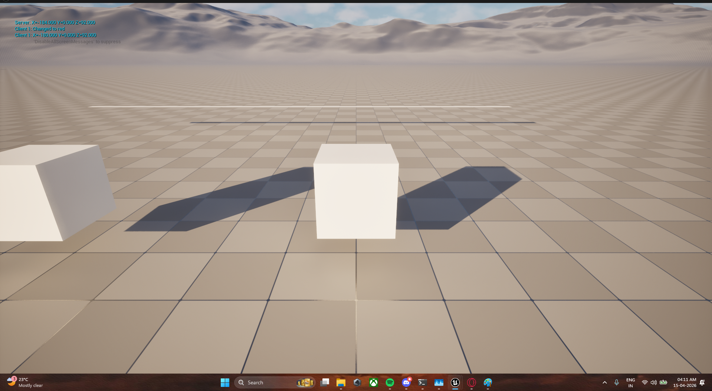
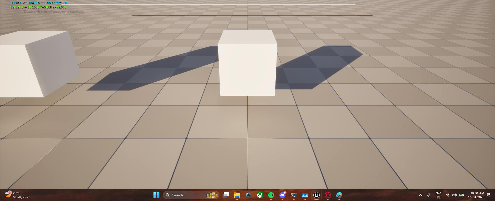

#  Phantom Packet (UE5)

A visual demonstration of client-side prediction and server reconciliation in multiplayer games.

---

## 🎬 Demo

---

## 🧠 The Problem

In multiplayer games, you may feel:

> "I was behind cover… but still got hit."

This happens because what the client sees is not always the server truth.

---

##  Desync (Phantom State)

Client and server disagree on position:

Client: X = -180  
Server: X = -184  

Error = 4 units  

This difference represents a **phantom state** —  
what the player sees vs what actually happened.

---

##  Synced (Reconciled State)

After reconciliation:

Client: X = -184  
Server: X = -184  

Error = 0  

The client is corrected to match the server.

---

## ⚙️ How It Works

1. Client moves instantly (prediction)
2. Server processes real position
3. If mismatch occurs → error is created
4. Client interpolates (VInterpTo) toward server position
5. Once close enough → system is synced

---

## 🧮 Key Insight

- Error > 0 → Phantom active  
- Error ≈ 0 → Synced  

---

## 🎮 Inspired By

Observed behavior in fast-paced games like Valorant:
- dashing but still dying  
- getting hit behind cover  

---

## 🛠 Tech

- Unreal Engine 5  
- Blueprint-based implementation  
- Custom client prediction + reconciliation system  
- Optional C++ integration  

---

## 🎯 Purpose

To understand multiplayer networking systems deeply  
instead of treating them as a black box.

---

## 🔮 Future Work

- Phantom trails (visual history of prediction)
- Error visualization in world space
- Hit registration simulation
